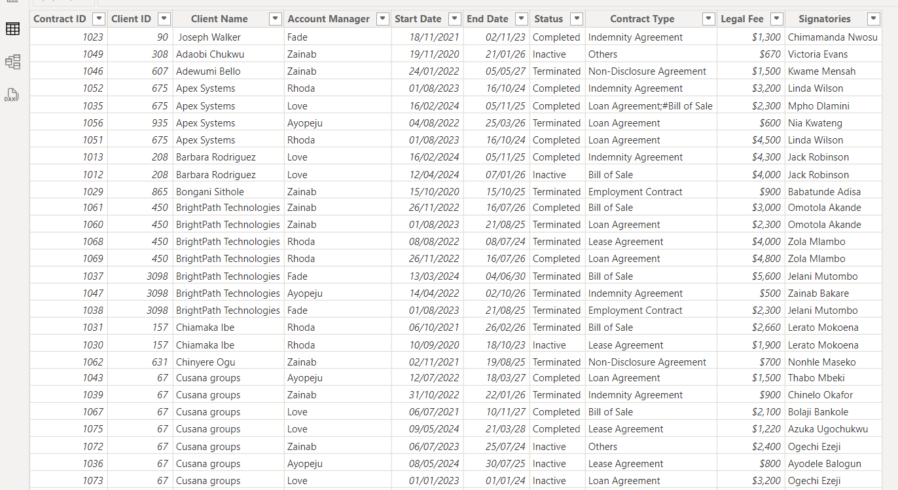
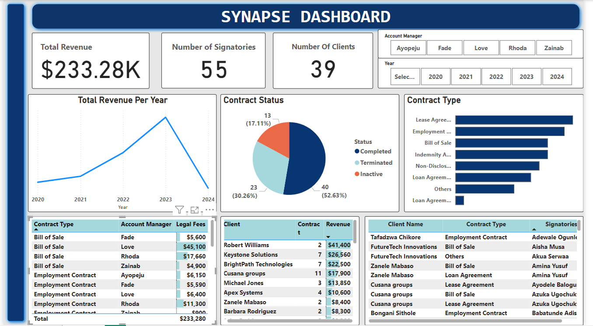

# Synapse Analysis

## Introduction
The power bi report is aimed at drawing out and analysing meaningful insights from a legal firm data set called synapse. the goal is to draw out meaningful insight which would aid management in making informed decisions to improve performance and high quality legal services to its clients, presented in a concise Report/Dashboard.

**_Disclaimer_**; All data sets report Do not represent any company, institution, or country but just a practice data set to demonstrate the capabilities of Power BI.

## Problem statement
1.	Identify the Total number of signatories and clients in the legal firm
2.	Identify the Total revenue generated from the legal firm per year.
3.	Identify the top contract type based on the number of contracts .
4.	Top 5 Clients with the highest contract revenue.
5.	Examine the Contract status for all contract types.

## Data sourcing
the data set is gotten from Synapse app data set, retrieved from sharepoint and extracted into Power BI for cleaning,analysis and visualization. it comprises of one table.

## Skills/Concept Demostrated
The following measures where incoperated ; count, sum, filters.

## Synapse Table

## Visualization

## Analysis

Question 1 answer; The total number of signatories is 55 and the total number of clients is 39.

Question 2 answer;
 The revenue generated in the year 2020 was $24.930. the revenue generated during the year 2021 was $26,050. The revenue generated from the year 2022 was $43,650, The revenue generated in the year 2023 was $66,830 and for The year 2024 it was $71,820. The total revenue generated for the legal firm is $233.280.

Question 3 answer; 
The top contracts based on the number of contracts is the lease agreement with a total number of 14 contracts followed by the Employment contract 13, Bill of sale and indemnity contract with an equal number of 11 each.

Question 4 answer;
The top clients in the legal firm due to the revenue generated are;
1.	Robert Williams with a total revenue of $41,400.
2.	Keystone Solutions with a total revenue of $26,560.
3.	Brightpath with a total revenue of $22,500.
4.	Cusana Groups with a total revenue $17,900.
5.	Apex systems with a total revenue of $10,600

Question 5 answer;
The contract status of each contract that was completed had a number of 40(52.63%), The terminated contracts were 23(30.26%) and inactive contracts with a total number of 13(17.11%).

## Conclusion and Reccommendation
- The loan agreement is the least contract in the legal firm with its number of client as 1, Further use of such contract is not advisable has it had the least amount of legal fee.

